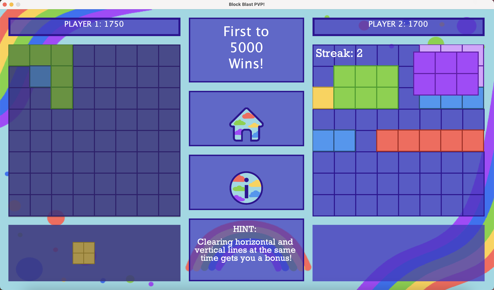
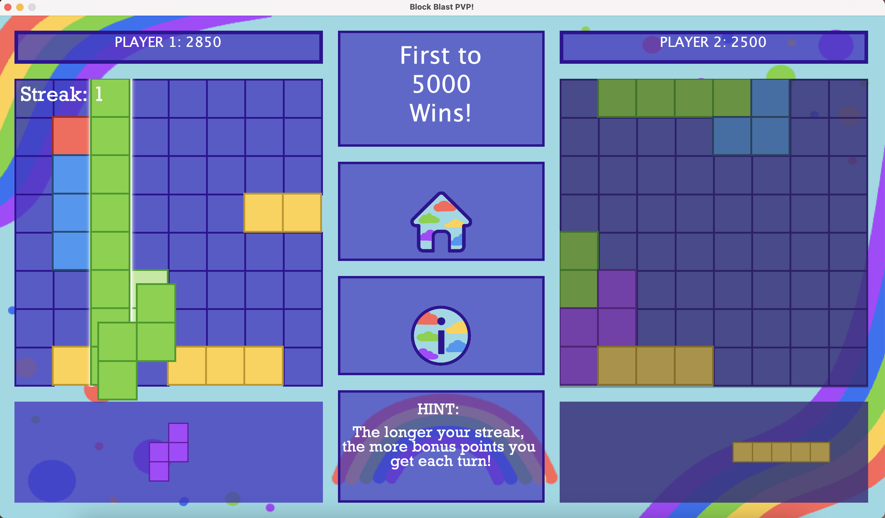

# BlockBlast PvP

A 2-player competitive puzzle game heavily inspired by BlockBlast (a 1-player mobile puzzle game) built in Java using Swing. Players take turns dragging blocks from their block bank onto a custom-rendered board to score points, receiving bonus points for various things like clearing the board, clearing a line, and getting a streak.

The game displays a win message either when someone reaches 5000 points or someone runs out of space, in which case the other player automatically wins.

## How to run
To run this project, clone the repo to your local machine and run the following commands in the root directory (they will just compile the project into a directory called bin, and then run the project):

```
mkdir bin
javac -d bin $(find src/blockblast -name "*.java")
cp -r src/resources/* bin/
java -cp bin blockblast.gui.BigGUI
```

In order to compile and run this project, you must have the JRE and JDK installed so that you can use `java` and `javac`. You can check if you have these installed with `java --version` and `javac --version`. If you don't have them installed, navigate to [this link](https://www.oracle.com/java/technologies/downloads/) and download the appropriate version for your OS.

## Demo images :)


