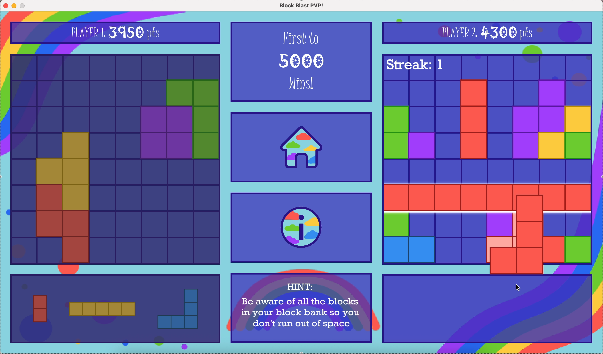
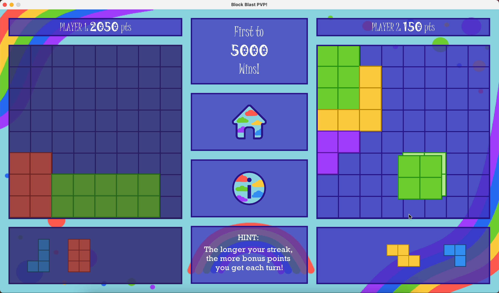

# BlockBlast PvP

A 2-player competitive puzzle game heavily inspired by BlockBlast (a 1-player mobile puzzle game) built in Java using Swing. Players take turns dragging blocks from their block bank onto a custom-rendered board to score points, receiving bonus points for various things like clearing the board, clearing a line, and getting a streak.

The game displays a win message either when someone reaches 5000 points or someone runs out of space, in which case the other player automatically wins.

## How to run
To run this project, clone the repo to your local machine and run `./buildandrun` in the root directory. Once you've run this script, you can rerun the project with `./run`, and if you make any changes you can re-compile and run with `./buildandrun` again.

In order to compile and run this project, you must have the JRE and JDK installed so that `java` and `javac` work. You can check if you have these installed with `java --version` and `javac --version`. If you don't have them installed, navigate to [this link](https://www.oracle.com/java/technologies/downloads/) and download the appropriate version for your OS.

The build scripts also will only work for macOS and Linux. If you want it to work for Windows you'd need Git Bash or WSL (Windows Subsystem for Linux).

## Demo images

## Demo videos
### Gameplay

https://github.com/user-attachments/assets/3c03946f-be0f-4998-816a-70166a89fead

https://github.com/user-attachments/assets/1d759609-95ca-44a2-9688-c8c28a63c131

https://github.com/user-attachments/assets/8409d4ac-7925-4b18-8ada-a0c1115ea66a

### Game end

https://github.com/user-attachments/assets/f608738b-8ace-430c-9838-457ebe885221

https://github.com/user-attachments/assets/59355160-586d-4b4b-a0fc-63a4ac874fa9
